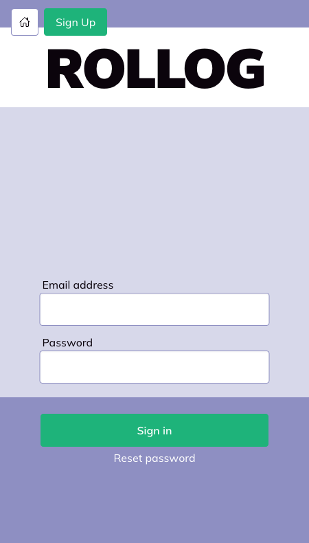
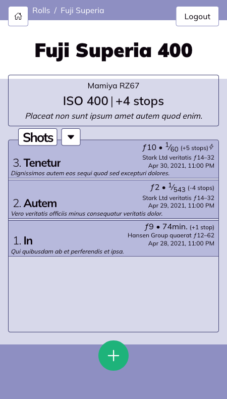

# ROLLOG

## About ROLLOG

ROLLOG is a tool for film photographers to track their shots and the camera settings for each shot. Modern digital cameras make this task trivial as they embed EXIF data and settings in each shot they take.

When a film photographer tracks their shots with ROLLOG, they can more easily learn how different settings and adjustments affect the final exposure.

## Features

- User added cameras and lenses
- Shots are organized by roll of film
- Detailed camera settings such as Exposure Time, ƒ stop, and stops of over or underexposure.

## Future (Dream) Features

- Logging of GPS data
- Process to tag a scan of the film exposure with EXIF data

# Development

If you wish to contribute to the development of ROLLOG, first make sure you have Docker and Node.js installed.

1. Run `docker compose run composer install` to install Laravel and PHP dependencies.
2. In seperate terminals, run `docker compose up server` and `docker compose up mysql`. This starts up our backend.
3. In yet another terminal, run `docker compose run server php artisan:migrate fresh --seed` to seed the database.
4. Next run `npm install` to install Node.js dependencies.
5. Finally, run `npm run dev` to spin up frontend hot-reloading.
6. Vite will tell you to access the application at `localhost:3000` however because we're using [Laravel Vite](https://laravel-vite.dev/), the entry point is actually `localhost:8080`.
7. To login, check the users table in the MySql database for a user email. The password should be `password`.

